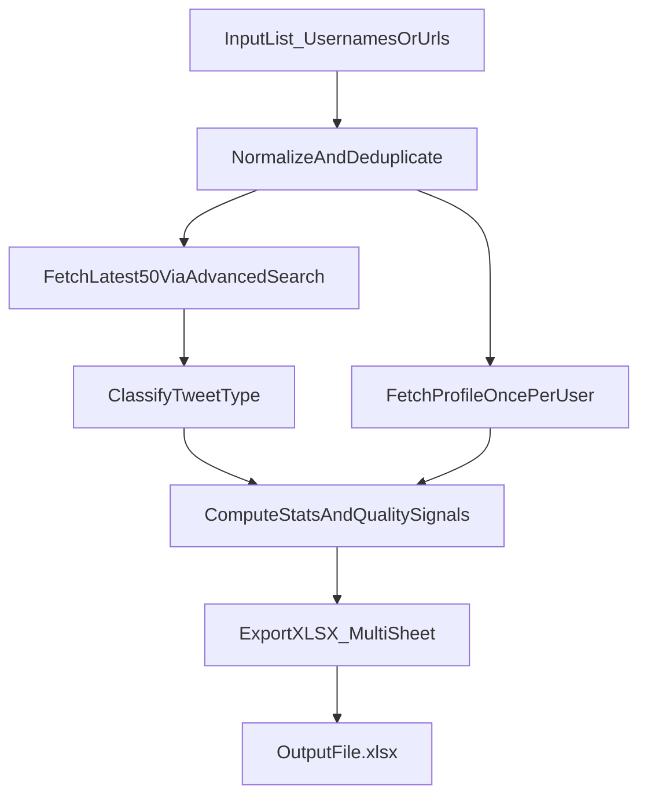

# Influencer Metrics Export (twitterapi.io)

## Goal

- Input: a list of influencer **usernames or profile URLs**.
- Output: a **clean, format-friendly `.xlsx`** containing:
  - Per-influencer aggregates (avg/median views/likes/etc, distribution stats)
  - Content-mix (original vs retweet vs quote) and “retweet-spam vs healthy” indicators
  - A per-post table for the 50 tweets (URLs + metrics + classification)

## Key API mapping (what we’ll use)

- **Fetch latest 50 posts (excluding replies):** use `GET /twitter/tweet/advanced_search` with query `from:<username> -filter:replies` (and `queryType=Latest`), paging via `next_cursor`.
  - Implementation reference: existing client `[...\social-capital-tool\src\lib\twitter-advanced-search.ts](c:\Users\smhus\Downloads\IdentityLabs Pdts\social-capital-tool\src\lib\twitter-advanced-search.ts)`.
  - Data includes per-tweet metrics: `viewCount`, `likeCount`, `replyCount`, `retweetCount`, `quoteCount`, `bookmarkCount`.
  - Data includes `quoted_tweet` / `retweeted_tweet` fields for classification.
- **Follower count (and stable profile metadata):** prefer `GET /twitter/user/info` (once per influencer) because it’s explicitly a profile endpoint and priced separately. If needed, we can fall back to the tweet’s `author.followers` field, but profile is cleaner.
  - Doc reference: `[...\social-capital-tool\twitterapiinfo.md](c:\Users\smhus\Downloads\IdentityLabs Pdts\social-capital-tool\twitterapiinfo.md)`.

## Proposed architecture (efficient + scalable)

We’ll implement this as a **local CLI script** using a small “core library” so it remains clean and later can be reused by a web UI if desired.

### Components

- **Input normalizer**
  - Accepts: `@handle`, `handle`, `https://x.com/handle`, `https://twitter.com/handle`.
  - Outputs: canonical `username` list (lowercased, no `@`).

- **Fetcher (twitterapi.io)**
  - Uses existing advanced search module (`fetchAdvancedSearchBulk`) with caps:
    - `maxTweets=50`
    - `maxPages=3–5` safety (50 tweets / 20 per page ≈ 3 pages; 5 gives slack)
    - `pageDelayMs` tuned to avoid 429s
  - Uses global QPS constraints from the provider:
    - QPS scales with account balance (3/6/10/20) per `[twitterapiinfo.md]`.
  - Batch strategy:
    - Per-user pagination is sequential (cursor-based).
    - Across users we can run limited concurrency, but still respect global QPS.

- **Classifier (per tweet)**
  - **Retweet**: `retweeted_tweet` present and non-empty.
  - **Quote tweet**: `quoted_tweet` present and non-empty.
  - **Original**: neither present.
  - (We’re excluding replies per your choice, so `isReply` should be rare; still record if present as a data-quality flag.)

- **Metrics engine**
  - For each influencer compute:
    - **Counts**: fetched tweets count, originals/retweets/quotes counts.
    - **Averages**: avg views/likes/replies/retweets/quotes/bookmarks.
    - **Medians**: median views/likes (and optionally for other metrics).
    - **Robust stats (recommended)**:
      - p25/p75 (IQR) for views & likes
      - trimmed mean (e.g. 10%) to reduce outlier bias
      - coefficient of variation (consistency)
    - **Rates (recommended)**:
      - engagement per view: \((likes+replies+retweets+quotes)/views\)
      - engagement per follower: \((likes+replies+retweets+quotes)/followers\)
      - views per follower
    - **Mix signals**:
      - retweet % / quote % / original %
      - link-post % (any URL in `entities.urls`)
      - top domains shared (e.g. `t.co` expanded domain)

- **“Paid retweet / promo openness” indicators (heuristics, not ground truth)**

There is no direct “paid” flag in the API, so we’ll output **signals** and **flags** instead of claiming certainty:

  - **Promo keyword flag**: `#ad`, `#sponsored`, `partner`, `paid`, `promo`, `use code`, `affiliate`, etc.
  - **High-retweet spam risk**: very high retweet % combined with low median views (or low views/follower) and high link %.
  - **Healthy amplifier profile**: moderate retweet % (e.g. 20–70%), non-trivial original %, stable medians.

- **XLSX exporter**
  - Use `exceljs` (already in `package.json`).
  - Sheets:
    - `Summary`: 1 row per influencer with key metrics + flags.
    - `Posts`: 1 row per tweet (influencer, createdAt, type, url, views/likes/etc, hasUrl, domains).
    - `Definitions`: explains each metric + how it’s computed (important for usability).

## Efficiency, cost, and scaling notes

- **Time complexity**: ~O(U × 50) tweet rows processed; API calls ~O(U × pages) where pages ≈ 3.
- **Cost estimate (from provider pricing)**:
  - Tweets: $0.15 / 1k tweets → \(0.15  *(U*50)/1000\) = **$0.0075 × U**
  - Profiles: $0.18 / 1k users → \(0.18 * U/1000\) = **$0.00018 × U**
- **Rate limits**: global QPS is the real throughput limiter; we’ll tune concurrency + delays to avoid 429 and maximize steady throughput.

## Reliability & data quality

- **Partial fetch handling**: if fewer than 50 tweets returned (ads filtered, user sparse), we still compute stats and annotate `fetchedCount`.
- **Missing/zero view counts**: treat as nullable and compute medians/means on non-null values; include `viewCoverage%`.
- **Error isolation**: one failing username shouldn’t fail the entire export; errors get a row in `Summary` with an `error` column.

## What else you may want to include (high-signal additions)

- **Recency-weighted performance**: last 10 vs previous 40 (momentum).
- **Outlier awareness**: max views and how much it distorts the mean (mean vs median delta).
- **Posting cadence**: timestamps of last 50; median time between posts.
- **Language/topic markers**: top hashtags/keywords; helps categorize niches.
- **Collaboration density**: most mentioned accounts; % of posts that mention other handles.

## Implementation touchpoints in this repo (when you approve)

- Reuse: `[...\social-capital-tool\src\lib\twitter-advanced-search.ts](c:\Users\smhus\Downloads\IdentityLabs Pdts\social-capital-tool\src\lib\twitter-advanced-search.ts)` for fetching.
- Reuse: `[...\social-capital-tool\src\lib\config\twitter-api-config.ts](c:\Users\smhus\Downloads\IdentityLabs Pdts\social-capital-tool\src\lib\config\twitter-api-config.ts)` for keys/QPS tuning.
- Add: a new CLI entry in `scripts/` (consistent with existing scripts) that generates the `.xlsx`.

## Todos

- normalize-input: Parse usernames/URLs, dedupe, validate.
- fetch-latest50: For each user, fetch 50 tweets via advanced search (`from:user -filter:replies`).
- classify-tweets: Determine original vs retweet vs quote; compute per-user mixes.
- compute-stats: Compute avg/median/percentiles/consistency + quality flags.
- export-xlsx: Produce multi-sheet workbook with definitions.
- harden: Add rate-limit friendly concurrency, partial-failure handling, and a final run summary.